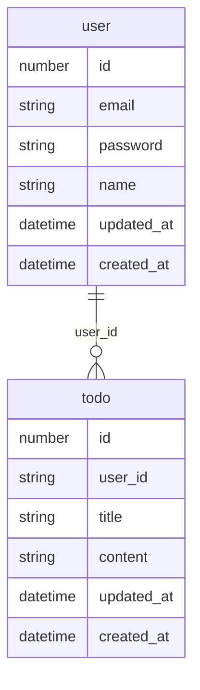

# Learging go api with go-chi and ent.

## Crate Project

```shell
go mod init go-chi-api
go mod tidy
```

## Install go-chi & ent.

```shell
go get -u github.com/go-chi/chi/v5
go get -d entgo.io/ent/cmd/ent
```

## Initialize schema

```shell
go run entgo.io/ent/cmd/ent init Todo
```



## Generate Code

Write schema and run below command

```shell
go generate ./ent
```

## Install mysql driver
